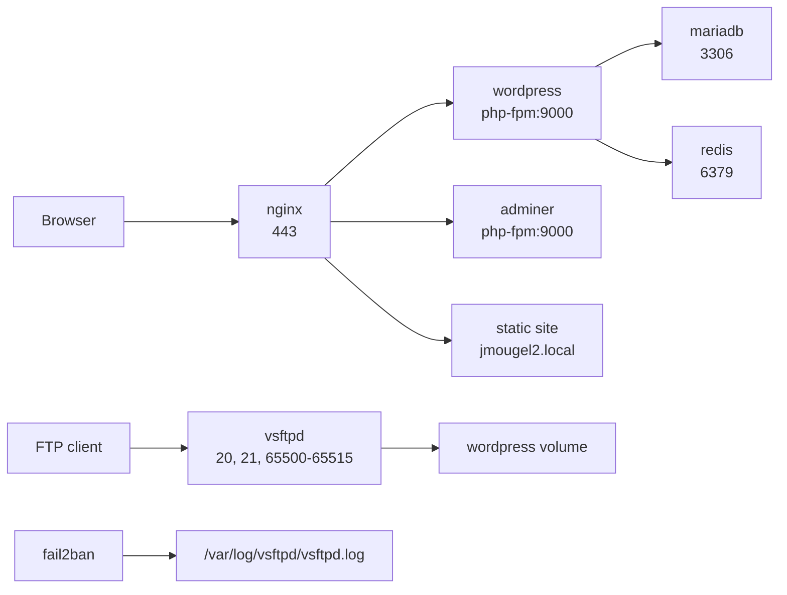

# Inception

*This project was created as part of the 42 curriculum by jmougel.*

## Description

Inception is a Docker Compose infrastructure project that deploys a complete WordPress stack from custom Debian-based images. The project is built to show how production-style services fit together: an HTTPS reverse proxy, a PHP application runtime, a database, persistent volumes, service networking, and automated initialization.

The mandatory stack provides:

- Nginx as the public HTTPS entrypoint
- WordPress served through PHP-FPM
- MariaDB as the persistent database
- A private Docker bridge network
- Persistent bind-mounted volumes under `/inception/data`

The bonus stack extends the project with Redis caching, Adminer, FTP access, Fail2ban protection, and a second static website.

## Documentation

- [USER_DOC.md](./USER_DOC.md): user and administrator guide for running, accessing, and checking the stack.
- [DEV_DOC.md](./DEV_DOC.md): developer guide for environment setup, builds, Docker Compose commands, volumes, and persistence.

## Objectives

This project is meant to validate practical understanding of:

- Docker image creation with custom Dockerfiles
- Multi-container orchestration with Docker Compose
- Container networking and service discovery
- TLS configuration with Nginx
- WordPress and MariaDB bootstrap automation
- Persistent data management with Docker volumes
- Runtime configuration through environment files
- Debugging service readiness, logs, ports, and startup order

## Features

- Custom Dockerfiles for every service
- HTTPS-only WordPress access on port `443`
- Self-signed certificate generation at runtime
- Automated MariaDB database, user, and privilege setup
- Automated WordPress download, configuration, and installation with WP-CLI
- WordPress salts generated from the WordPress API with a local fallback
- Persistent WordPress files and MariaDB data
- Private Docker network for internal traffic
- Bonus Redis cache service
- Bonus Adminer panel at `/adminer/`
- Bonus FTP server with passive ports `65500-65515`
- Bonus Fail2ban jail monitoring FTP logs
- Bonus second static site on `jmougel2.local`

## Constraints

- Each service runs in a dedicated container.
- Containers are built from local project Dockerfiles.
- Nginx is the only public web entrypoint.
- WordPress and MariaDB data persist outside the containers.
- Services communicate through the Docker network, not host networking.
- Secrets and runtime values are configured with `.env` files.
- The stack is managed through Makefile targets and Docker Compose.
- The mandatory and bonus stacks use fixed container names, so only one stack should run at a time.

## Tech Stack

- **Languages:** Shell, YAML, PHP configuration, Nginx configuration
- **Tools:** Docker, Docker Compose, Make, WP-CLI, OpenSSL
- **Services:** Nginx, WordPress, PHP-FPM, MariaDB, Redis, Adminer, vsftpd, Fail2ban
- **Environment:** Debian Bullseye containers on a Linux host

## Prerequisites

- `make`
- `docker`
- `docker compose`
- `sudo` access
- Permission to create and remove `/inception/data`
- Local DNS entries in `/etc/hosts`

Add the local domains:

```text
127.0.0.1 jmougel.local
127.0.0.1 jmougel2.local
```

`jmougel2.local` is only required for the bonus static site.

## Instructions

### Installation

```bash
git clone <repository_url> inception
cd inception
cp srcs/.env.example srcs/.env
cp bonus/srcs/.env.example bonus/srcs/.env
```

Fill every `<REPLACE_HERE>` value in the `.env` files before launching the project.

### Usage

Mandatory stack:

| Command | Description |
| --- | --- |
| `make up` | Create the data directories, build the images, and start the mandatory stack in detached mode. |
| `make down` | Stop and remove the mandatory stack containers while keeping persistent data. |
| `make re` | Rebuild the mandatory stack from a clean state by running `down`, `clean`, then `up`. |
| `make clean` | Stop the mandatory stack, remove Compose volumes, and delete WordPress and MariaDB data directories. |
| `make fclean` | Run `clean`, then remove unused Docker images, containers, networks, and build cache. |

Bonus stack:

| Command | Description |
| --- | --- |
| `cd bonus && make up` | Create the data directories, build the images, and start the bonus stack in detached mode. |
| `cd bonus && make down` | Stop and remove the bonus stack containers while keeping persistent data. |
| `cd bonus && make re` | Rebuild the bonus stack from a clean state by running `down`, `clean`, then `up`. |
| `cd bonus && make clean` | Stop the bonus stack, remove Compose volumes, and delete WordPress and MariaDB data directories. |
| `cd bonus && make fclean` | Run `clean`, then remove unused Docker images, containers, networks, and build cache. |

## Access

| URL | Description |
| --- | --- |
| `https://jmougel.local` | Main WordPress application served over HTTPS. |
| `https://jmougel2.local` | Bonus static website. |
| `https://jmougel.local/adminer/` | Bonus Adminer interface for database administration. |
| `ftp://jmougel.local` | Bonus FTP endpoint for accessing WordPress files. |

### Credentials

Credentials are defined in the active `.env` file:

- **WordPress admin:** `jmougel` / `MARIADB_ROOT_PASSWORD`
- **WordPress author:** `MARIADB_USER` / `MARIADB_USER_PASSWORD`
- **MariaDB user:** `MARIADB_USER` / `MARIADB_USER_PASSWORD`
- **MariaDB root:** `root` / `MARIADB_ROOT_PASSWORD`
- **FTP bonus user:** `FTP_USER` / `FTP_PASS`

## Validation

Render the Compose configuration:

```bash
docker compose -f srcs/docker-compose.yml config
docker compose -f bonus/srcs/docker-compose.yml config
```

Check running services:

```bash
sudo docker compose -f srcs/docker-compose.yml ps
sudo docker compose -f bonus/srcs/docker-compose.yml ps
```

Check web access:

```bash
curl -kI https://jmougel.local
curl -kI https://jmougel.local/wp-admin/
curl -kI https://jmougel.local/adminer/
curl -kI https://jmougel2.local
```

Expected result:

- Nginx listens on `443`.
- WordPress loads through HTTPS.
- WordPress can connect to MariaDB.
- Data remains after `make down` and `make up`.
- Bonus services start and are reachable through their documented ports or routes.

## Architecture

Mandatory stack:


Bonus stack:



## Notes

- Browsers will warn about the certificate because it is self-signed.
- `make clean` removes `/inception/data/wp` and `/inception/data/db`.
- `make fclean` also runs `docker system prune -af`.
- If `jmougel.local` does not resolve, check `/etc/hosts`.
- If port `443` is already in use, stop the conflicting service before starting this stack.
- If Nginx returns a gateway timeout, check the `wordpress` container and PHP-FPM port `9000`.

## Project Structure

```text
.
|-- Makefile
|-- README.md
|-- USER_DOC.md
|-- DEV_DOC.md
|-- srcs
|   |-- docker-compose.yml
|   |-- .env.example
|   `-- requirements
|       |-- mariadb
|       |-- nginx
|       `-- wordpress
`-- bonus
    |-- Makefile
    `-- srcs
        |-- docker-compose.yml
        |-- .env.example
        `-- requirements
            |-- adminer
            |-- fail2ban
            |-- ftp
            |-- mariadb
            |-- nginx
            |-- redis
            `-- wordpress
```

## Resources

- [Docker documentation](https://docs.docker.com/)
- [Docker Compose documentation](https://docs.docker.com/compose/)
- [Nginx documentation](https://nginx.org/en/docs/)
- [WordPress documentation](https://wordpress.org/documentation/)
- [WP-CLI documentation](https://wp-cli.org/)
- [MariaDB documentation](https://mariadb.org/documentation/)
- [Redis documentation](https://redis.io/docs/latest/)
- [Adminer documentation](https://www.adminer.org/)
- [vsftpd project page](https://security.appspot.com/vsftpd.html)
- [Fail2ban documentation](https://www.fail2ban.org/wiki/index.php/Main_Page)

## AI Usage

AI assistance was used to improve documentation structure, clarity, and troubleshooting coverage. Commands, services, paths, and access points were checked against the repository files.

## Author

- **Login:** jmougel
- **GitHub:** [jasonmgl](https://github.com/jasonmgl)

## License

This project is for educational purposes.
