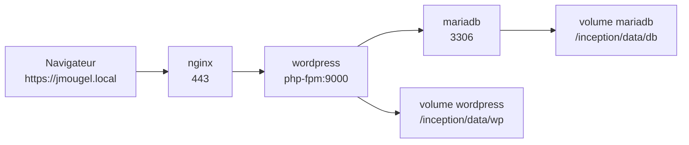

# Inception

*Ce projet a été réalisé dans le cadre du cursus 42 par jmougel.*

## Description

*[an english version is available here.](./README_EN.md)*

Inception est un projet d’infrastructure basé sur Docker Compose qui déploie une stack WordPress complète à partir d’images Debian personnalisées. Le projet a été conçu pour montrer comment des services proches d’un environnement de production s’assemblent : un reverse proxy HTTPS, un environnement d’exécution PHP pour l’application, une base de données, des volumes persistants, un réseau de services et une initialisation automatisée.

La stack obligatoire fournit :

- Nginx comme point d’entrée HTTPS public
- WordPress servi via PHP-FPM
- MariaDB comme base de données persistante
- Un réseau Docker bridge privé
- Des volumes persistants montés sous `/inception/data`

La stack bonus étend le projet avec un cache Redis, Adminer, un accès FTP, une protection Fail2ban et un second site statique.

## Documentation

- [USER_DOC.md](./USER_DOC.md) : guide utilisateur et administrateur pour lancer, accéder et vérifier la stack.
- [DEV_DOC.md](./DEV_DOC.md) : guide développeur pour la configuration de l’environnement, les builds, les commandes Docker Compose, les volumes et la persistance.

## Objectifs

Ce projet a pour but de valider une compréhension pratique de :

- La création d’images Docker avec des Dockerfiles personnalisés
- L’orchestration multi-conteneurs avec Docker Compose
- Le réseau entre conteneurs et la découverte de services
- La configuration TLS avec Nginx
- L’automatisation du bootstrap de WordPress et MariaDB
- La gestion de données persistantes avec les volumes Docker
- La configuration à l’exécution via des fichiers d’environnement
- Le débogage de la disponibilité des services, des logs, des ports et de l’ordre de démarrage

## Fonctionnalités

- Dockerfiles personnalisés pour chaque service
- Accès à WordPress uniquement en HTTPS sur le port `443`
- Génération d’un certificat auto-signé au démarrage
- Création automatisée de la base MariaDB, de l’utilisateur et des privilèges
- Téléchargement, configuration et installation automatisés de WordPress avec WP-CLI
- Génération des clés salts WordPress depuis l’API WordPress avec une solution de secours locale
- Persistance des fichiers WordPress et des données MariaDB
- Réseau Docker privé pour le trafic interne
- Service de cache Redis en bonus
- Interface Adminer en bonus sur `/adminer/`
- Serveur FTP en bonus avec ports passifs `65500-65515`
- Jail Fail2ban en bonus surveillant les logs FTP
- Second site statique en bonus sur `jmougel2.local`

## Contraintes

- Chaque service s’exécute dans un conteneur dédié.
- Les conteneurs sont construits à partir des Dockerfiles locaux du projet.
- Nginx est le seul point d’entrée web public.
- Les données WordPress et MariaDB persistent en dehors des conteneurs.
- Les services communiquent via le réseau Docker, et non via le réseau hôte.
- Les secrets et valeurs d’exécution sont configurés avec des fichiers `.env`.
- La stack est gérée via des cibles Makefile et Docker Compose.
- Les stacks obligatoire et bonus utilisent des noms de conteneurs fixes, donc une seule stack doit être lancée à la fois.

## Stack technique

- **Langages :** Shell, YAML, configuration PHP, configuration Nginx
- **Outils :** Docker, Docker Compose, Make, WP-CLI, OpenSSL
- **Services :** Nginx, WordPress, PHP-FPM, MariaDB, Redis, Adminer, vsftpd, Fail2ban
- **Environnement :** conteneurs Debian Bullseye sur un hôte Linux

## Prérequis

- `make`
- `docker`
- `docker compose`
- un accès `sudo`
- les permissions nécessaires pour créer et supprimer `/inception/data`
- des entrées DNS locales dans `/etc/hosts`

Ajoute les domaines locaux suivants :

```text
127.0.0.1 jmougel.local
127.0.0.1 jmougel2.local
```

`jmougel2.local` n’est requis que pour le site statique bonus.

## Instructions

### Installation

```bash
git clone <repository_url> inception
cd inception
cp srcs/.env.example srcs/.env
cp bonus/srcs/.env.example bonus/srcs/.env
```

Remplis toutes les valeurs `<REPLACE_HERE>` dans les fichiers `.env` avant de lancer le projet.

### Utilisation

Stack obligatoire :

| Commande | Description |
| --- | --- |
| `make up` | Crée les répertoires de données, construit les images et démarre la stack obligatoire en mode détaché. |
| `make down` | Arrête et supprime les conteneurs de la stack obligatoire tout en conservant les données persistantes. |
| `make re` | Reconstruit la stack obligatoire depuis un état propre en exécutant `down`, `clean`, puis `up`. |
| `make clean` | Arrête la stack obligatoire, supprime les volumes Compose et efface les répertoires de données WordPress et MariaDB. |
| `make fclean` | Exécute `clean`, puis supprime les images Docker inutilisées, les conteneurs, les réseaux et le cache de build. |

Stack bonus :

| Commande | Description |
| --- | --- |
| `cd bonus && make up` | Crée les répertoires de données, construit les images et démarre la stack bonus en mode détaché. |
| `cd bonus && make down` | Arrête et supprime les conteneurs de la stack bonus tout en conservant les données persistantes. |
| `cd bonus && make re` | Reconstruit la stack bonus depuis un état propre en exécutant `down`, `clean`, puis `up`. |
| `cd bonus && make clean` | Arrête la stack bonus, supprime les volumes Compose et efface les répertoires de données WordPress et MariaDB. |
| `cd bonus && make fclean` | Exécute `clean`, puis supprime les images Docker inutilisées, les conteneurs, les réseaux et le cache de build. |

## Accès

| URL | Description |
| --- | --- |
| `https://jmougel.local` | Application WordPress principale servie en HTTPS. |
| `https://jmougel2.local` | Site statique bonus. |
| `https://jmougel.local/adminer/` | Interface Adminer bonus pour l’administration de la base de données. |
| `ftp://jmougel.local` | Point d’accès FTP bonus pour accéder aux fichiers WordPress. |

### Identifiants

Les identifiants sont définis dans le fichier `.env` actif :

- **Administrateur WordPress :** `jmougel` / `MARIADB_ROOT_PASSWORD`
- **Auteur WordPress :** `MARIADB_USER` / `MARIADB_USER_PASSWORD`
- **Utilisateur MariaDB :** `MARIADB_USER` / `MARIADB_USER_PASSWORD`
- **Root MariaDB :** `root` / `MARIADB_ROOT_PASSWORD`
- **Utilisateur FTP bonus :** `FTP_USER` / `FTP_PASS`

## Validation

Afficher la configuration Compose :

```bash
docker compose -f srcs/docker-compose.yml config
docker compose -f bonus/srcs/docker-compose.yml config
```

Vérifier les services en cours d’exécution :

```bash
sudo docker compose -f srcs/docker-compose.yml ps
sudo docker compose -f bonus/srcs/docker-compose.yml ps
```

Vérifier l’accès web :

```bash
curl -kI https://jmougel.local
curl -kI https://jmougel.local/wp-admin/
curl -kI https://jmougel.local/adminer/
curl -kI https://jmougel2.local
```

Résultat attendu :

- Nginx écoute sur le port `443`.
- WordPress se charge via HTTPS.
- WordPress peut se connecter à MariaDB.
- Les données restent présentes après `make down` puis `make up`.
- Les services bonus démarrent et sont accessibles via leurs ports ou routes documentés.

## Architecture

Stack obligatoire :



Stack bonus :


## Notes

- Les navigateurs afficheront un avertissement concernant le certificat car il est auto-signé.
- `make clean` supprime `/inception/data/wp` et `/inception/data/db`.
- `make fclean` exécute aussi `docker system prune -af`.
- Si `jmougel.local` ne se résout pas, vérifie `/etc/hosts`.
- Si le port `443` est déjà utilisé, arrête le service en conflit avant de démarrer cette stack.
- Si Nginx retourne un gateway timeout, vérifie le conteneur `wordpress` et le port PHP-FPM `9000`.

## Structure du projet

```text
.
|-- Makefile
|-- README.md
|-- USER_DOC.md
|-- DEV_DOC.md
|-- srcs
|   |-- docker-compose.yml
|   |-- .env.example
|   `-- requirements
|       |-- mariadb
|       |-- nginx
|       `-- wordpress
`-- bonus
    |-- Makefile
    `-- srcs
        |-- docker-compose.yml
        |-- .env.example
        `-- requirements
            |-- adminer
            |-- fail2ban
            |-- ftp
            |-- mariadb
            |-- nginx
            |-- redis
            `-- wordpress
```

## Ressources

- [Documentation Docker](https://docs.docker.com/)
- [Documentation Docker Compose](https://docs.docker.com/compose/)
- [Documentation Nginx](https://nginx.org/en/docs/)
- [Documentation WordPress](https://wordpress.org/documentation/)
- [Documentation WP-CLI](https://wp-cli.org/)
- [Documentation MariaDB](https://mariadb.org/documentation/)
- [Documentation Redis](https://redis.io/docs/latest/)
- [Documentation Adminer](https://www.adminer.org/)
- [Page du projet vsftpd](https://security.appspot.com/vsftpd.html)
- [Documentation Fail2ban](https://www.fail2ban.org/wiki/index.php/Main_Page)

## Utilisation de l’IA

Une assistance par IA a été utilisée pour améliorer la structure de la documentation, sa clarté et la couverture du dépannage. Les commandes, services, chemins et points d’accès ont été vérifiés par rapport aux fichiers du dépôt.

## Auteur

- **Login :** jmougel
- **GitHub :** [jasonmgl](https://github.com/jasonmgl)

## Licence

Ce projet est réalisé à des fins éducatives.
